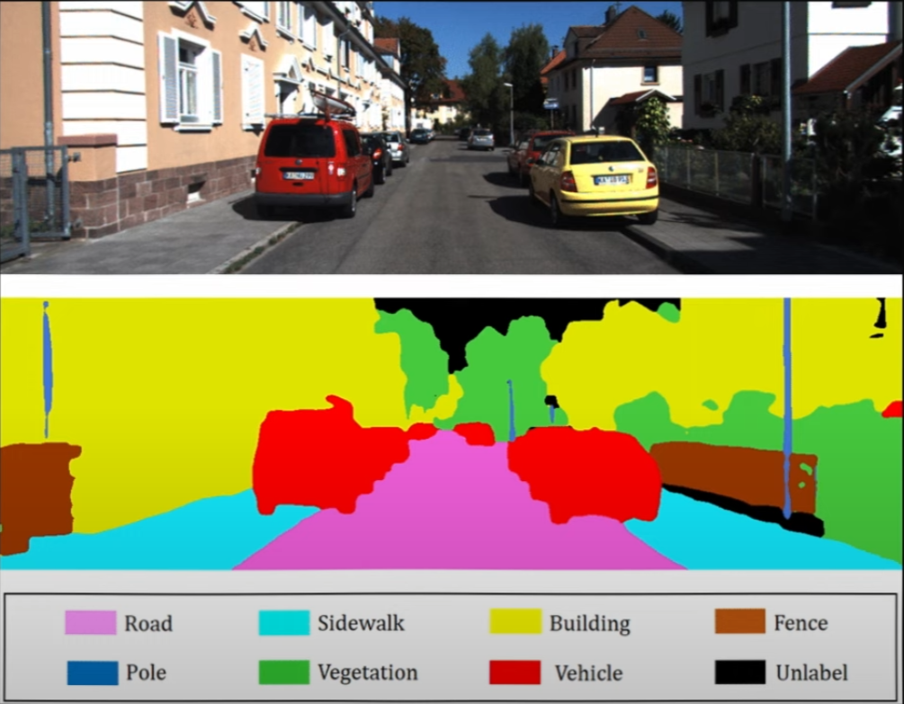

---
jupyter:
  jupytext:
    text_representation:
      extension: .md
      format_name: markdown
      format_version: '1.3'
      jupytext_version: 1.15.2
---

# Stable Diffusion

Stable diffusion is a generative AI tech that creates and manipulates images from prompts or other images. The model uses labeled images as training data and outputs images or modification of images.  
To use stable diffusion model, we input a text prompt, then the model outputs an image. This means Stable Diffusion has multiple models inside it.  
Here's how it works :

## The Image Layer   
The main function of the image layer is to extract all the possible information inside an image, and encode it into a digestible format.  
### Convolutional Network  
Convolutional network is a type of neural network that has a 3x3 matrix (called kernel) moving to scan every area of an image to extract its features such as lines, shadows, highlights, color, saturation, etc. [[1]](https://ieeexplore.ieee.org/abstract/document/8308186) [[2]](https://arxiv.org/abs/1511.08458)  

### Semantic Segmentation with U-Net  
Semantic segmentation is a task to segment image into multiple classes and tell them what they are. This task is achieved by using convolutional network with specialized kernels. [[3]](https://ieeexplore.ieee.org/abstract/document/8354267)  

  

One of the most efficient semantic segmentation algorithm is U-Net. [[4]](https://ieeexplore.ieee.org/abstract/document/9446143)   

  

The U-Net is trained using raw images and the images' perfect black-and-white mask as the ground truth (or target).  
If normal convolutional models scans images in 2 dimensions (width and length), The U-Net scans images in 3 dimensions (width, length, and channels). An image consists of 3 channels, Red, Green, and Blue. Each channel can make their own monochromic image.   

  

At the same time, U-Net also compresses the size of the image after each cycle, increasing field of view, while keeping the same kernel size, making it able to extract more and more features.  

We are now at the bottom of the U curve, the model has learned all the features of the image. Now its time to scale the image back up to original size.  

The U-net up-samples the image based on the image received before the image is getting compressed (hence the copy and crop grey arrow)  

### U-Net as Image Denoiser  
Because U-Net does such a good job at semantic segmentation, people are experimenting with using U-Net as an image denoiser. Noise is unwanted pixel value deviations in the image that can alter the overal perception of the image. Image denoiser's primary job is to remove noise. [[5]](https://openaccess.thecvf.com/content/ICCV2021W/NeurArch/html/Jia_DDUNet_Dense_Dense_U-Net_With_Applications_in_Image_Denoising_ICCVW_2021_paper.html)  

If we generate a completely random pixels which constitutes a pure noise image, then we add a (perfect) image of fish on top of it, the result is a noised image of a fish.  
That means, if we have a noised image of a fish, then subtract the pure noise image out of it, then we have a perfect image of a fish.   

    

In this image denoising model, the input is a noised image of a fish, and the ground truth is the pure noise image. However, we want to train this model in small steps. Each step, the noise going to be removed ever so slightly. Over many many steps (lets say 10, or even 1000), we will get the clean, perfect denoised image.  

However, the model does not know how noisy the input image is. To do that we will use positional encoding or embedding. Positional encoding is converting discrete variables (image sequence numbers) into continuous vectors so its easily processed by the model.  
This embedded is added into every step of the red arrow (maxpool/compression) and green arrow (upsample) as shown in the U-Net architecture.  

### Auto-Encoder  
Auto-encoder refers to a neural network that encodes data, compresses it into a smaller representation which is called latent space, then decode the latent space into the original data form.  
What is encoding, latent space, and decoding? Take a look at this [website](https://n8python.github.io/mnistLatentSpace/)   
The MNIST dataset image resolution is 28x28 is represented by 784 parameters times the amount of images in it.  
Then all the images are encoded into latent space of just 2 parameters (x and y coordinates) so we can map it on a 2d plane.  
Once we select the coordinates, the latent space parameters gets decoded into 28x28 image, resembling the original dataset.   

    

In Stable Diffusion, the trained images gets encoded (compressed) into smaller latent space.  
Then we perform the noising/denoising training steps.  
Finally, we decode that modified image in the latent space into its original resolution.
Operating the image in latent space significantly decreasing processing times and increasing feature stability. This is what the **stable** means in Stable Diffusion. [[6]](https://deci.ai/deep-learning-glossary/stable-diffusion/)  

## The Word Layer  
The main function of the word layer is to extract all the possible context a sentence or word, and encode it into a digestible format.  

### Text Embedding  
We need a way to represent words into something a model can digest. The answer is embedding using word2vec. [Computerphile](https://www.youtube.com/watch?v=gQddtTdmG_8) made a great video about this.  
So we gather all the english words into one database, then we put an index to each word.  
Then we encode the index using positional encoding, converting an integer into a vector (just like embedding in U-Net).  
However, we will create a copy of the database, but this time with randomized index, then encode it using positional encoding too.  
After that, we look for training data that contains perfect grammar from dictionary, internet articles, comments, captioned speeches, etc.  
Then we count how many times x word is positioned next to y words, then build a relationship model from it.  
For example, there are 2 word-pairings, "cute kitten" and "cute bottle". Because "cute kitten" appears much more frequently than "cute bottle", it means that the word "cute" is more likely to be followed with "kitten" as opposed to "bottle"  

You can check this demo of fully graphed multidimensional text embedding in this [Website](https://projector.tensorflow.org/)   

The coolest thing is, because the text embedding is made up of vectors, adding and subtracting vectors is very similar to adding and subtracting *meaning* in real life context.  

    

### Self Attention  
Self attention main function is to extract features from phrases using relationships between words depending on their text embeddings vectors.  [[7]](https://proceedings.neurips.cc/paper_files/paper/2017/hash/3f5ee243547dee91fbd053c1c4a845aa-Abstract.html)

